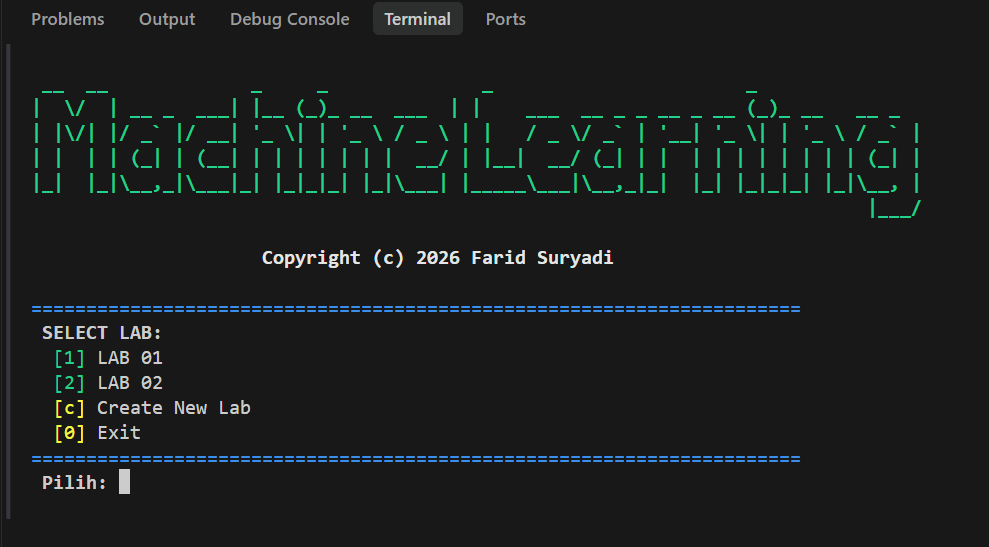

<div align="center">

# 🤖 Machine Learning Labs
**Kumpulan Praktikum dan Implementasi Machine Learning**  
*Mulai dari Regresi Linear, Klasifikasi, Q-Learning hingga Deep Q-Network (DQN)*

[](#)
[](#)
[](#)

<!-- Ganti link gif di bawah dengan GIF rekaman layar aplikasimu -->


</div>

---

## 💡 Tentang Proyek
Repositori ini adalah sebuah **Workspace Universal** untuk menyimpan dan mengeksekusi berbagai macam script *Machine Learning*, yang tersusun sistematis dalam setiap "Lab". Diciptakan dengan navigasi CLI (Command-Line Interface) yang interaktif, kamu cukup menggunakan satu perintah saja untuk menjelajahi semua tugas yang ada.

## 📦 Pustaka (Library) Utama

Proyek ini dibangun menggunakan pustaka Machine Learning & Data Science terbaik di industri:
- **`scikit-learn`** — Algoritma inti ML (Regresi, Klasifikasi, PCA, Random Forest).
- **`tensorflow`** — Operasi berbasis Deep Learning seperti DQN (Deep Q-Network).
- **`numpy`** — Komputasi matriks dan operasi matematika.
- **`pandas`** — Manipulasi, kebersihan struktur, dan pemrosesan dataset.
- **`matplotlib`** — Visualisasi data tingkat tinggi dan analisis diagram fitur.

---

## ⚡ Tata Cara Penggunaan

### 1. Unduh Proyek (Clone)
Langkah pertama, unduh sistem ke pc/komputer lokal Anda lalu masuk ke direktorinya via terminal:
```bash
git clone https://github.com/USERNAME/NAMA_REPOSITORI_ANDA.git
cd "Machine Learning"
```

### 2. Persiapan Environment
Direkomendasikan menjalankan *virtual environment* bawaan yang ada di folder `.venv`.
```bash
# Untuk Windows:
.venv\Scripts\activate

# Install dependency:
pip install -r requirements.txt
```

### 3. Menjalankan Aplikasi
Jalankan file utama untuk membuka terminal CLI interaktif:
```bash
python main.py
```
*Aplikasi akan otomatis memindai seluruh folder berawalan `lab-` dan memasukkannya ke dalam daftar antarmuka secara *real-time!*

---

## 🚀 Fitur Unggulan: "Auto Create New Lab"

Workspace ini dilengkapi dengan fitur cerdas pembuat Lab otomatis guna meminimalkan pengulangan membuat folder/arsitektur internal:

1. Pada halaman awal, pilih opsi **`[c] Create New Lab`**.
2. Anda akan diminta memasukkan nomor. Contoh: `3` atau `03`.
3. Program akan **secara otomatis**:
   - Mendaftarkan lab baru (`lab-03`).
   - Membuat folder `scripts` di dalamnya (`lab-03/scripts/`).
   - Memasukkannya langsung ke dalam Menu Utama *tanpa perlu restart*.
4. Anda cukup fokus meletakkan file `.py` di dalam folder `scripts` tersebut, dan sistem akan meng-ekstrak menjadi sub-menu yang siap dijalankan!

---

## 📊 Hasil Output Visualisasi

Berikut contoh hasil plot dan kalkulasi data visual (silakan ganti link gambar sesuai dengan jalur file gambar Anda nanti):

<br>

<div align="center">
  <table border="1" cellpadding="10" bordercolor="#ccc" align="center" style="border-collapse: collapse;">
    <tr align="center">
      <td>
        <a href="output/[LAB-01]%20Customer%20Clustering.png" target="_blank"></a>
        <br><code>[LAB-01] Customer Clustering.png</code>
      </td>
      <td>
        <a href="output/[LAB-01]%20Dqn%20Tensorflow.png" target="_blank"></a>
        <br><code>[LAB-01] Dqn Tensorflow.png</code>
      </td>
      <td>
        <a href="output/[LAB-01]%20House%20Price.png" target="_blank"></a>
        <br><code>[LAB-01] House Price.png</code>
      </td>
    </tr>
    <tr align="center">
      <td>
        <a href="output/[LAB-01]%20Pca%20Iris.png" target="_blank"></a>
        <br><code>[LAB-01] Pca Iris.png</code>
      </td>
      <td>
        <a href="output/[LAB-01]%20Q%20Learning%20Maze.png" target="_blank"></a>
        <br><code>[LAB-01] Q Learning Maze.png</code>
      </td>
      <td>
        <a href="output/[LAB-01]%20Spam%20Email.png" target="_blank"></a>
        <br><code>[LAB-01] Spam Email.png</code>
      </td>
    </tr>
    <tr align="center">
      <td>
        <a href="output/[LAB-02]%20House%20Price%20Prediction%20RF.png" target="_blank"></a>
        <br><code>[LAB-02] House Price Prediction RF.png</code>
      </td>
      <td>
        <a href="output/[LAB-02]%20Model%20Evaluation.png" target="_blank"></a>
        <br><code>[LAB-02] Model Evaluation.png</code>
      </td>
      <td>
        <a href="output/[LAB-02]%20Multivariate%20Regression.png" target="_blank"></a>
        <br><code>[LAB-02] Multivariate Regression.png</code>
      </td>
    </tr>
    <tr align="center">
      <td colspan="3">
        <a href="output/[LAB-02]%20Simple%20Linear%20Regression.png" target="_blank"></a>
        <br><code>[LAB-02] Simple Linear Regression.png</code>
      </td>
    </tr>
  </table>
  <br>
  <em>Tabel: Panel Dashboard visualisasi Output Data Model. (Klik gambar untuk zoom/Buka penuh)</em>
</div>

---

<br>

<br>
<hr>

<div align="center">
  <h2>Hi  I'm Farid Suryadi</h2>
  
  <p><b>✨ Let's connect and build something awesome together! ✨</b></p>
  
  <p>
      <a href="https://t.me/greyvbss" target="_blank">
          
      </a>
      &nbsp;
      <a href="https://www.instagram.com/faridsrydi" target="_blank">
          
      </a>
  </p>

  <br>
  
  

  <br><br><br>

  <h3>© 2026 Farid Suryadi. All Rights Reserved.</h3>
  <p><i>Dibuat dan dirancang khusus untuk pembelajaran sistem pakar dan Machine Learning.</i></p>
</div>
