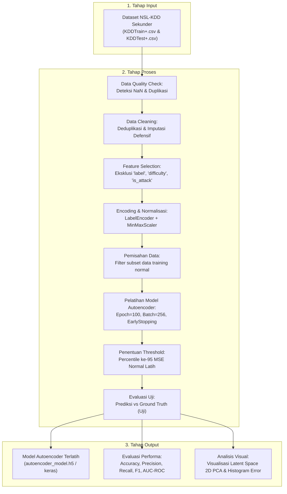

# LAPORAN PENELITIAN
## DETEKSI ANOMALI LALU LINTAS JARINGAN (INTRUSION DETECTION) MENGGUNAKAN ALGORITMA DEEP AUTOENCODER PADA DATASET NSL-KDD

---

**Oleh:**  
**[Nama Lengkap Anda]**  
**[NIM/NPM Anda]**  

**PROGRAM STUDI TEKNIK INFORMATIKA**  
**FAKULTAS TEKNIK DAN ILMU KOMPUTER**  
**[Nama Universitas Anda]**  
**2026**

---

### KATA PENGANTAR

Puji dan syukur penulis panjatkan ke hadirat Allah SWT atas rahmat dan karunia-Nya sehingga laporan penelitian yang berjudul **"Deteksi Anomali Lalu Lintas Jaringan (Intrusion Detection) Menggunakan Algoritma Deep Autoencoder pada Dataset NSL-KDD"** ini dapat diselesaikan dengan baik dan tepat waktu.

Laporan ini disusun sebagai bentuk dokumentasi ilmiah dan laporan hasil eksperimen dari implementasi metode pembelajaran mendalam (*Deep Learning*), khususnya arsitektur *Unsupervised Deep Autoencoder*, untuk mendeteksi lalu lintas jaringan yang bersifat anomali (serangan/intrusi) menggunakan dataset benchmark NSL-KDD. Seluruh proses penelitian, mulai dari tahapan analisis data eksploratif (EDA), prapemrosesan data, perancangan model, pengujian threshold rekonstruksi, hingga analisis performa model pembanding (Isolation Forest dan One-Class SVM) diimplementasikan menggunakan bahasa pemrograman Python di lingkungan Jupyter Notebook.

Penulis menyadari bahwa penulisan laporan ini masih jauh dari sempurna. Oleh karena itu, segala bentuk kritik, masukan, dan saran yang membangun sangat penulis harapkan demi penyempurnaan karya ilmiah ini di masa mendatang. Akhir kata, penulis berharap laporan ini dapat memberikan kontribusi keilmuan yang bermanfaat bagi pembaca, akademisi, serta praktisi di bidang *machine learning* dan *cybersecurity*.

[Kota Anda], 7 Juli 2026  

Penulis  

---

### DAFTAR ISI

*   **KATA PENGANTAR** ............................................................................................................ I
*   **DAFTAR ISI** .................................................................................................................... II
*   **BAB 1: PENDAHULUAN** .................................................................................................... 1
    *   1.1 Latar Belakang ................................................................................................... 1
    *   1.2 Rumusan Masalah ............................................................................................. 2
    *   1.3 Batasan Masalah .............................................................................................. 2
    *   1.4 Tujuan Penelitian ............................................................................................... 3
    *   1.5 Manfaat Penelitian ............................................................................................. 3
    *   1.6 Metode Penelitian ............................................................................................. 3
    *   1.7 Sistematika Penulisan ......................................................................................... 4
*   **BAB 2: TINJAUAN PUSTAKA** ........................................................................................... 6
    *   2.1 Penelitian Terdahulu ......................................................................................... 6
    *   2.2 Landasan Teori .................................................................................................. 9
*   **BAB 3: METODOLOGI PENELITIAN** ................................................................................ 14
    *   3.1 Kerangka Berpikir ............................................................................................. 14
    *   3.2 Pengumpulan dan Pengolahan Data ................................................................. 15
    *   3.3 Pengumpulan Data ........................................................................................... 16
    *   3.4 Perancangan Teknik/Model (Kebaharuan) ........................................................ 19
    *   3.5 Evaluasi Teknik/Model ....................................................................................... 22
*   **BAB 4: IMPLEMENTASI DAN EKSPERIMEN** .................................................................... 25
    *   4.1 Persiapan Data ................................................................................................. 25
    *   4.2 Implementasi Teknik/Model .............................................................................. 27
    *   4.3 Hasil dan Analisis ............................................................................................. 30
*   **BAB 5: PENUTUP** ............................................................................................................ 35
    *   5.1 Kesimpulan ....................................................................................................... 35
    *   5.2 Saran ............................................................................................................... 36
*   **DAFTAR PUSTAKA** ......................................................................................................... 38
*   **LAMPIRAN-LAMPIRAN** ................................................................................................... 39

---

### BAB 1: PENDAHULUAN

#### 1.1 Latar Belakang
Perkembangan teknologi informasi dan komunikasi di era digital saat ini telah memicu lonjakan lalu lintas data secara eksponensial di seluruh belahan dunia. Adopsi layanan berbasis awan (*cloud computing*), *mobile application*, infrastruktur *Internet of Things* (IoT), serta digitalisasi sektor kritikal telah menjadikan internet sebagai tulang punggung aktivitas sosial, bisnis, dan pemerintahan. Namun, ketergantungan yang tinggi terhadap konektivitas jaringan ini berbanding lurus dengan peningkatan kompleksitas serta volume ancaman keamanan siber (*cyber threats*).

Kejahatan siber modern tidak lagi sekadar berupa serangan terisolasi, melainkan aktivitas terorganisasi dengan taktik yang terus berevolusi. Serangan bertipe *Denial of Service* (DoS), pemindaian jaringan secara masif (*probing*), infiltrasi akses remote (*Remote to Local* atau R2L), hingga ekskalasi hak akses sistem (*User to Root* atau U2R) menjadi ancaman konkrit yang mampu melumpuhkan infrastruktur digital institusi global. Sistem deteksi intrusi jaringan (*Network Intrusion Detection System* atau NIDS) memegang peranan krusial sebagai garis pertahanan dalam mendeteksi dan mencegah penyusupan ini sebelum berdampak pada kerusakan sistem.

Secara umum, NIDS konvensional menggunakan pendekatan berbasis tanda (*signature-based detection*). Sistem ini bekerja dengan mencocokkan lalu lintas jaringan terhadap database pola serangan yang sudah diketahui sebelumnya. Meskipun metode ini sangat akurat untuk mengenali serangan lama, ia memiliki kelemahan fatal, yaitu ketidakmampuannya dalam mendeteksi serangan baru yang belum terdaftar di database (*zero-day attack*). Di samping itu, pemeliharaan database secara manual memerlukan biaya komputasi yang tinggi dan rentan terhadap keterlambatan pembaruan *signature*.

Sebagai alternatif, dikembangkanlah sistem deteksi berbasis anomali (*anomaly-based detection*). Sistem ini memodelkan pola lalu lintas jaringan normal sebagai representasi dasar (*baseline*), dan menandai segala bentuk aktivitas yang menyimpang secara signifikan dari baseline sebagai ancaman keamanan. Pendekatan pembelajaran mesin terawasi (*supervised learning*) sering kali diimplementasikan untuk tujuan ini. Namun, *supervised learning* sangat bergantung pada ketersediaan data latih yang memiliki label (*labeled data*). Pada dunia nyata, pelabelan data lalu lintas jaringan berskala besar memerlukan waktu, biaya tinggi, serta analisis manual dari pakar keamanan siber. Selain itu, dataset keamanan siber umumnya memiliki ketimpangan kelas (*class imbalance*) yang sangat ekstrem, di mana lalu lintas normal mendominasi secara mutlak dibandingkan aktivitas serangan.

Untuk mengatasi permasalahan tersebut, pendekatan tanpa pengawasan (*unsupervised learning*) menjadi solusi yang lebih menjanjikan karena tidak membutuhkan label historis selama proses pelatihan model. Salah satu metode *deep learning* yang sangat efektif untuk memodelkan struktur data tanpa pengawasan adalah **Deep Autoencoder**. Autoencoder bekerja dengan mereduksi dimensi data input melalui representasi ruang laten terkompresi (*bottleneck*) lalu merekonstruksinya kembali seperti semula. 

Apabila model Autoencoder dilatih hanya menggunakan data lalu lintas jaringan **normal**, model tersebut akan belajar merekonstruksi data normal dengan tingkat kesalahan (*reconstruction error*) yang sangat kecil. Ketika data serangan (anomali) yang polanya asing dilewatkan pada model tersebut, Autoencoder akan gagal merekonstruksinya dengan baik, menghasilkan nilai *reconstruction error* yang tinggi. Perbedaan nilai error rekonstruksi inilah yang dijadikan indikator klasifikasi untuk membedakan aktivitas normal dan serangan jaringan secara dinamis tanpa ketergantungan pada label serangan.

Berdasarkan potensi tersebut, penelitian ini berfokus pada implementasi dan evaluasi performa model *Deep Autoencoder* untuk deteksi anomali pada dataset benchmark keamanan siber **NSL-KDD**, serta membandingkan performanya dengan metode anomali *unsupervised* konvensional seperti *Isolation Forest* dan *One-Class SVM*.

#### 1.2 Rumusan Masalah
Berdasarkan latar belakang masalah di atas, maka rumusan masalah dalam penelitian ini didefinisikan sebagai berikut:
1. Bagaimana tahapan prapemrosesan data (*preprocessing*) dan rancangan arsitektur Deep Autoencoder yang tepat untuk mengolah lalu lintas jaringan berdimensi tinggi pada dataset NSL-KDD?
2. Bagaimana menentukan nilai ambang batas (*threshold reconstruction error*) secara objektif untuk membedakan lalu lintas normal dan serangan?
3. Sejauh mana tingkat efektivitas dan performa model Deep Autoencoder (diukur melalui metrik *Accuracy*, *Precision*, *Recall*, *F1-Score*, dan *AUC-ROC*) jika dibandingkan dengan model baseline *Isolation Forest* dan *One-Class SVM*?
4. Kategori serangan jaringan mana (dari DoS, Probe, R2L, U2R) yang paling sukses diidentifikasi dan yang paling menantang bagi model Deep Autoencoder?

#### 1.3 Batasan Masalah
Agar penelitian ini terfokus pada sasaran yang telah ditentukan dan menjaga kedalaman pembahasan, batasan masalah ditetapkan sebagai berikut:
1. Dataset yang digunakan terbatas pada dataset publik **NSL-KDD** (menggunakan berkas `KDDTrain+.csv` untuk pelatihan dan `KDDTest+.csv` untuk pengujian).
2. Algoritma pembelajaran mendalam utama yang diteliti adalah *Deep Autoencoder* berbasis *fully-connected layer* (Multi-Layer Perceptron) dengan loss function *Mean Squared Error* (MSE).
3. Algoritma pembanding dibatasi pada metode *unsupervised anomaly detection* konvensional yaitu *Isolation Forest* dan *One-Class Support Vector Machine* (One-Class SVM).
4. Klasifikasi hasil akhir bersifat biner, yaitu mengklasifikasikan lalu lintas data ke dalam kelas **Normal (0)** atau **Attack/Serangan (1)**.
5. Proses preprocessing, pengembangan model, pelatihan, visualisasi, dan evaluasi performa diimplementasikan penuh menggunakan bahasa pemrograman **Python** dengan pustaka Keras/TensorFlow dan Scikit-Learn.

#### 1.4 Tujuan Penelitian
Tujuan yang ingin dicapai melalui pelaksanaan penelitian ini adalah:
1. Membangun dan mengimplementasikan model *Deep Autoencoder* yang terstruktur untuk melakukan deteksi intrusi tanpa pengawasan (*unsupervised*) pada dataset NSL-KDD.
2. Mengembangkan mekanisme penentuan *threshold* rekonstruksi secara dinamis berbasis data latih normal untuk meminimalkan *false alarm rate*.
3. Mengevaluasi performa model Deep Autoencoder secara kuantitatif serta memetakan perbandingannya terhadap algoritma *Isolation Forest* dan *One-Class SVM*.
4. Menganalisis daya deteksi model terhadap masing-masing rumpun serangan jaringan (DoS, Probe, R2L, U2R) untuk mengidentifikasi kekuatan dan keterbatasan arsitektur Autoencoder.

#### 1.5 Manfaat Penelitian
Adapun manfaat yang diharapkan dari penelitian ini meliputi:
1. **Manfaat Akademis**: Memberikan kontribusi ilmiah berupa referensi literatur dan kajian praktis mengenai efektivitas algoritma *deep learning* tanpa pengawasan untuk mendeteksi pencilan (*outlier*) pada domain keamanan komputer.
2. **Manfaat bagi Peneliti**: Mengembangkan keahlian teknis dalam merancang *pipeline data science* terstruktur, mengatasi masalah data dengan dimensi tinggi, menangani *data quality check*, serta memodelkan arsitektur Autoencoder.
3. **Manfaat Praktis/Industri**: Menyediakan alternatif skema deteksi intrusi jaringan yang adaptif terhadap serangan baru (*zero-day*) tanpa membutuhkan proses pelabelan data manual yang intensif, yang dapat diintegrasikan pada ekosistem keamanan jaringan perusahaan.

#### 1.6 Metode Penelitian
Metode penelitian ini dijalankan secara sistematis melalui lima tahapan utama berbasis kerangka kerja sains data (*Data Science Lifecycle*) guna menjamin validitas hasil eksperimen:
1.  **Pengumpulan Data (Data Collection)**: Mengakuisisi berkas sekunder `KDDTrain+.csv` (125.973 baris) dan `KDDTest+.csv` (19.642 baris) dari repositori NSL-KDD.
2.  **Prapemrosesan Data (Data Preprocessing)**: Melakukan pemeriksaan kualitas data (*Data Quality Check*) untuk mengidentifikasi *missing values* dan duplikasi, menerapkan *Label Encoding* pada fitur kategorikal, melakukan normalisasi skala fitur menggunakan *MinMaxScaler*, serta memisahkan subset data normal untuk melatih Autoencoder secara *unsupervised*.
3.  **Perancangan dan Pemodelan (Model Development)**: Membangun arsitektur *Deep Autoencoder* dengan konfigurasi penyusutan dimensi bertahap (`41 -> 32 -> 16 -> 8 -> 16 -> 32 -> 41`) menggunakan TensorFlow/Keras. Pada tahap ini diimplementasikan pula model pembanding *Isolation Forest* dan *One-Class SVM* dengan Scikit-Learn.
4.  **Pengujian dan Evaluasi Model (Testing & Evaluation)**: Menentukan threshold deteksi dari percentile ke-95 *reconstruction error* data latih normal. Melakukan pengujian klasifikasi biner pada data uji campuran (normal & attack) lalu mengukur nilai *Accuracy*, *Precision*, *Recall*, *F1-Score*, serta grafik *ROC Curve* (AUC).
5.  **Analisis Hasil dan Penarikan Kesimpulan**: Menganalisis efektivitas deteksi per rumpun serangan, mengekstrak representasi terkompresi dari ruang laten (*latent space*) melalui teknik PCA 2D untuk visualisasi sebaran data, membandingkan performa antar model, serta menarik kesimpulan akhir.

#### 1.7 Sistematika Penulisan
Dokumen laporan penelitian ini disusun secara terorganisir ke dalam lima bab sebagai berikut:
*   **BAB 1: PENDAHULUAN**  
    Memaparkan latar belakang pentingnya deteksi intrusi jaringan, rumusan masalah penelitian, batasan-batasan dalam eksperimen, tujuan dan manfaat penulisan, metode penelitian, serta sistematika penulisan laporan.
*   **BAB 2: TINJAUAN PUSTAKA**  
    Menyajikan komparasi kritis dengan penelitian terdahulu yang relevan dalam bentuk tabel, serta landasan teori pendukung seperti konsep IDS, dataset NSL-KDD, cara kerja algoritma Autoencoder secara matematis, model pembanding, dan metrik evaluasi.
*   **BAB 3: METODOLOGI PENELITIAN**  
    Menjelaskan alur penelitian melalui diagram alir kerangka berpikir, deskripsi rinci pengolahan data mentah, aspek kebaharuan rancangan model, penentuan threshold berbasis data, dan skema evaluasi performa.
*   **BAB 4: IMPLEMENTASI DAN EKSPERIMEN**  
    Menyajikan detail implementasi teknis berupa cuplikan kode (*source code listing*), konfigurasi parameter pelatihan, visualisasi grafis dari hasil eksperimen (kurva loss, confusion matrix, perbandingan ROC, dan reduksi ruang laten), serta analisis temuan eksperimen.
*   **BAB 5: PENUTUP**  
    Berisi kesimpulan akhir yang merangkum jawaban atas rumusan masalah penelitian berdasarkan fakta data pengujian, serta saran konstruktif bagi pengembangan penelitian sejenis di masa mendatang.

---

### BAB 2: TINJAUAN PUSTAKA

#### 2.1 Penelitian Terdahulu
Kajian terhadap penelitian terdahulu berfungsi sebagai pijakan dasar dan landasan komparatif untuk menjustifikasi kebaruan (*novelty*) dari penelitian yang diusulkan. Deteksi anomali lalu lintas jaringan telah dikaji menggunakan berbagai pendekatan machine learning. Pemetaan literatur relevan yang melandasi penelitian ini disajikan dalam Tabel 2.1 berikut.

**Tabel 2.1 Ringkasan Penelitian Terdahulu**

| No | Penulis & Tahun | Metode & Dataset | Kekurangan | Kebaharuan Penelitian Ini |
| :---: | :--- | :--- | :--- | :--- |
| 1 | Shone et al. (2018) | Stacked NDAE + Random Forest; NSL-KDD & KDD Cup 99 | Tahap klasifikasi akhir menggunakan *supervised* (Random Forest) sehingga tetap bergantung pada label serangan. | Pendekatan *unsupervised* murni berbasis *reconstruction error* tanpa membutuhkan label serangan. |
| 2 | Farahnakian & Heikkonen (2018) | Deep Autoencoder + Softmax Classifier; KDD Cup 99 | Dataset KDD Cup 99 mengandung jutaan duplikat yang menyebabkan bias metrik evaluasi. | Menggunakan NSL-KDD yang telah mengeliminasi duplikasi dan memiliki *difficulty score*. |
| 3 | Mirsky et al. (2018) | Ensemble Autoencoder (KitNET); Dataset custom | Arsitektur ensemble yang kompleks dan tidak diuji pada dataset benchmark standar. | Arsitektur *single deep autoencoder* yang lebih sederhana, diuji pada benchmark NSL-KDD. |
| 4 | Zavrak & Iskefiyeli (2020) | Variational Autoencoder (VAE); NSL-KDD & UNSW-NB15 | VAE menambahkan kompleksitas (*KL-divergence*) dan belum menganalisis performa per kategori serangan. | *Vanilla* Autoencoder yang lebih ringan dengan BN + Dropout, serta analisis per kategori (DoS, Probe, R2L, U2R). |

Berdasarkan kajian pustaka di atas, posisi penelitian ini adalah menyajikan implementasi *unsupervised* Deep Autoencoder yang dilatih hanya dengan data normal untuk deteksi intrusi jaringan pada dataset NSL-KDD, dengan penekanan pada penanganan kualitas data (*Data Quality Check*), penentuan *threshold* rekonstruksi berbasis data (*data-driven*), perbandingan langsung terhadap model baseline (Isolation Forest dan One-Class SVM), serta analisis performa spesifik per kategori serangan jaringan.

#### 2.2 Landasan Teori

Subbab ini menyajikan landasan teori yang menjadi pondasi konseptual dalam penelitian ini. Pembahasan dimulai dari konsep dasar Sistem Deteksi Intrusi (IDS) sebagai konteks permasalahan, dilanjutkan dengan deskripsi dataset benchmark NSL-KDD yang digunakan sebagai bahan eksperimen. Kemudian, diuraikan teknik preprocessing data yang diterapkan, prinsip kerja arsitektur Deep Autoencoder, teknik regularisasi untuk mencegah *overfitting*, mekanisme penghitungan skor anomali berbasis *Mean Squared Error* (MSE), dan ditutup dengan penjelasan singkat mengenai dua algoritma pembanding yang digunakan dalam evaluasi performa model.

##### 2.2.1 Sistem Deteksi Intrusi (Intrusion Detection System / IDS)
*Intrusion Detection System* (IDS) adalah perangkat lunak atau sistem fisik yang memantau lalu lintas jaringan komputer dari aktivitas mencurigakan dan memberikan notifikasi jika terdeteksi indikasi serangan. IDS berbasis anomali (*Anomaly-based IDS*) memantau profil lalu lintas data dan membandingkannya dengan kondisi normal dasar. Jika lalu lintas jaringan menyimpang secara signifikan dari baseline normal, aktivitas tersebut diklasifikasikan sebagai intrusi.

##### 2.2.2 Dataset NSL-KDD
Dataset NSL-KDD dikembangkan untuk mengatasi kelemahan inherent pada dataset pendahulunya, KDD Cup 99, yang didominasi oleh jutaan baris data duplikat sehingga menyebabkan bias pada performa klasifikasi model machine learning. NSL-KDD menyediakan jumlah baris data latih dan uji yang wajar, tanpa adanya catatan duplikat pada subset data latih. Dataset ini memiliki 41 fitur yang menggambarkan lalu lintas koneksi jaringan, ditambah dengan label klasifikasi serangan dan tingkat kesulitan deteksi (*difficulty score*). 

Serangan pada NSL-KDD dapat dikelompokkan ke dalam empat rumpun kategori utama:
1.  **Denial of Service (DoS)**: Serangan yang bertujuan membebani sumber daya sistem jaringan (misalnya serangan *neptune*, *back*, atau *smurf*).
2.  **Probe**: Serangan pengintaian untuk memetakan arsitektur dan celah keamanan jaringan (misalnya *satan* atau *ipsweep*).
3.  **Remote to Local (R2L)**: Upaya mendapatkan akses lokal ke mesin jaringan dari komputer jarak jauh tanpa hak resmi (misalnya *guess_passwd* atau *warezclient*).
4.  **User to Root (U2R)**: Upaya ekskalasi privilege dari akun pengguna biasa menjadi superuser/root (misalnya *buffer_overflow*).

##### 2.2.3 Teknik Preprocessing Data
Prapemrosesan data merupakan tahapan krusial dalam *pipeline machine learning* yang bertujuan mengubah data mentah menjadi format yang siap dikonsumsi oleh algoritma pemodelan. Dalam penelitian ini, dua teknik preprocessing utama yang digunakan adalah:

1.  **Label Encoding**: Teknik transformasi data kategorikal (teks) menjadi representasi numerik bilangan bulat. Setiap nilai unik dalam suatu kolom kategorikal dipetakan ke angka integer yang berbeda. Sebagai contoh, kolom `protocol_type` yang memiliki nilai `{tcp, udp, icmp}` akan dikonversi menjadi `{0, 1, 2}`. Teknik ini diperlukan karena sebagian besar algoritma *machine learning*, termasuk jaringan saraf tiruan, hanya dapat memproses data bertipe numerik.
2.  **MinMaxScaler (Normalisasi Min-Max)**: Teknik penskalaan fitur yang mentransformasikan nilai setiap fitur ke dalam rentang seragam $[0, 1]$ menggunakan formula:
    $$x_{\text{scaled}} = \frac{x - x_{\min}}{x_{\max} - x_{\min}}$$
    Normalisasi ini sangat penting pada jaringan saraf tiruan karena fitur dengan skala yang sangat berbeda (misalnya `src_bytes` bernilai jutaan sedangkan `land` hanya bernilai 0 atau 1) dapat menyebabkan dominasi gradien oleh fitur berskala besar, sehingga menghambat proses konvergensi model selama pelatihan.

##### 2.2.4 Konsep Arsitektur Deep Autoencoder
Autoencoder adalah jenis jaringan saraf tiruan (*artificial neural network*) bertipe *feed-forward* yang dilatih untuk merekonstruksi inputnya sendiri pada bagian output layer. Autoencoder terdiri atas tiga bagian utama:

```
          Encoder               Decoder
Input (x) -------> Laten (z) -------> Output (x̂)
  41 dim           8 dim              41 dim
```

1.  **Encoder**: Mengurangi dimensi input $x$ menjadi representasi ruang laten $z$ yang berdimensi lebih rendah melalui fungsi aktivasi non-linear $f$:
    $$z = f(W_e \cdot x + b_e)$$
    di mana $W_e$ adalah matriks bobot encoder dan $b_e$ adalah bias encoder.
2.  **Bottleneck (Latent Space / Hidden Representation)**: Layer tengah yang menampung representasi fitur terkompresi dari data input. Pengurangan dimensi memaksa model hanya mempelajari pola-pola paling esensial dari data normal.
3.  **Decoder**: Memetakan representasi laten $z$ kembali ke ruang dimensi asal untuk menghasilkan rekonstruksi input $\hat{x}$ melalui fungsi $g$:
    $$\hat{x} = g(W_d \cdot z + b_d)$$
    di mana $W_d$ adalah bobot decoder dan $b_d$ adalah bias decoder.

##### 2.2.5 Teknik Regularisasi pada Jaringan Saraf Tiruan
Untuk mencegah fenomena *overfitting* — kondisi di mana model terlalu "menghafal" data latih sehingga gagal menggeneralisasi pada data baru — diterapkan dua teknik regularisasi pada arsitektur Autoencoder dalam penelitian ini:

1.  **Batch Normalization**: Teknik normalisasi yang menstandarkan distribusi output setiap layer tersembunyi (*hidden layer*) sebelum dilewatkan ke layer berikutnya. Pada setiap *mini-batch* selama pelatihan, Batch Normalization menghitung rata-rata ($\mu_B$) dan variansi ($\sigma_B^2$) dari output layer, kemudian menormalisasinya:
    $$\hat{x}_i = \frac{x_i - \mu_B}{\sqrt{\sigma_B^2 + \epsilon}}$$
    Teknik ini mempercepat proses konvergensi pelatihan, menstabilkan distribusi gradien, dan memungkinkan penggunaan *learning rate* yang lebih tinggi tanpa risiko divergensi.
2.  **Dropout**: Teknik regularisasi yang secara acak menonaktifkan (meng-*zero*-kan) sebagian nodus (*neuron*) pada setiap iterasi pelatihan dengan probabilitas tertentu (dalam penelitian ini sebesar 20%). Mekanisme ini memaksa jaringan untuk tidak bergantung pada nodus-nodus tertentu saja, sehingga mendorong pembentukan representasi fitur yang lebih terdistribusi dan robust. Selama fase pengujian (*inference*), seluruh nodus diaktifkan kembali dengan bobot yang diskalakan.

##### 2.2.6 Mean Squared Error (MSE) sebagai Anomaly Score
Tingkat keberhasilan rekonstruksi diukur menggunakan fungsi kerugian *Mean Squared Error* (MSE) antara data input asli $x$ dengan data output rekonstruksi $\hat{x}$ untuk setiap instans ke-$i$ yang memiliki jumlah fitur $n$:
$$MSE = \frac{1}{n} \sum_{j=1}^{n} (x_{ij} - \hat{x}_{ij})^2$$

Nilai MSE ini bertindak sebagai **skor anomali (anomaly score)**. Data dengan nilai MSE yang melebihi nilai batas (*threshold*) $\tau$ dikategorikan sebagai anomali:
$$\text{Prediksi} = \begin{cases} 1 \text{ (Serangan)}, & \text{jika } MSE > \tau \\ 0 \text{ (Normal)}, & \text{jika } MSE \le \tau \end{cases}$$

##### 2.2.7 Metode Pembanding: Isolation Forest & One-Class SVM
*   **Isolation Forest**: Algoritma deteksi anomali berbasis pohon keputusan (*decision tree*). Algoritma ini mengisolasi data anomali dengan cara mempartisi ruang fitur secara acak. Data anomali yang bernilai ekstrem memerlukan lebih sedikit partisi untuk terisolasi sehingga memiliki panjang jalur (*path length*) yang lebih pendek pada struktur pohon biner.
*   **One-Class SVM**: Varian Support Vector Machine (SVM) untuk klasifikasi satu kelas. Algoritma ini memetakan data ke ruang dimensi tinggi menggunakan fungsi kernel dan membangun batas keputusan (*hyperplane*) yang memaksimalkan margin antara data normal dengan titik asal (origin).

---

### BAB 3: METODOLOGI PENELITIAN

#### 3.1 Kerangka Berpikir
Penelitian ini disusun berdasarkan kerangka berpikir terprogram untuk menjamin alur kerja eksperimen yang terstruktur dari hulu ke hilir. Kerangka berpikir digambarkan dalam diagram alir *swimlane* tiga tahap berikut:



#### 3.2 Pengumpulan dan Pengolahan Data
Tahap akuisisi data dilakukan dengan memuat dataset NSL-KDD dari direktori lokal `dataset/`. Dataset dimuat langsung menggunakan pustaka Pandas ke dalam bentuk objek DataFrame.
Proses pengolahan data dirancang secara terprogram untuk membersihkan gangguan (*noise*), menstandardisasi tipe data, dan mengubah skala sebaran fitur ke rentang seragam $[0, 1]$ agar mempercepat konvergensi gradien turun (*gradient descent*) jaringan saraf tiruan.

#### 3.3 Pengumpulan Data
Dataset asli memuat karakteristik sebagai berikut:
*   **KDDTrain+.csv** terdiri dari **125.973 baris** dan **43 kolom**.
*   **KDDTest+.csv** terdiri dari **19.642 baris** dan **43 kolom**.
*   **Tipe Data**: Fitur kategorikal berjumlah 3 buah (`protocol_type`, `service`, `flag`), fitur numerik berkelanjutan (*continuous*) berjumlah 38 buah, ditambah kolom label target (`label`) dan bobot kesulitan (`difficulty`).

Pemeriksaan kualitas data awal (*Data Quality Check*) secara otomatis dijalankan dengan instruksi:
```python
df.isnull().sum()
df.duplicated().sum()
```
Hasil pengecekan awal mengkonfirmasi kelengkapan data murni (0 *missing values*), namun sistem tetap dibekali fungsi penanganan darurat berbasis imputasi nilai median untuk ketahanan sistem (*fault tolerance*) masa depan.

#### 3.4 Perancangan Teknik/Model (Kebaharuan)
Penelitian ini menawarkan beberapa aspek perancangan teknis terintegrasi yang membedakannya dari model eksperimental sederhana terdahulu:

##### 1. Pipeline Preprocessing yang Bersih dan Defensif
Tidak langsung melatih data mentah, melainkan menerapkan penggabungan DataFrame train-test secara dinamis saat tahap encoding fitur kategorikal guna menghindari ketidakcocokan dimensi matriks (*dimension mismatch*) akibat perbedaan kategori pada data latih dan data uji. Dilakukan pula eliminasi nilai NaN pasca-prediksi rekonstruksi.

##### 2. Arsitektur Deep Autoencoder dengan Teknik Regularisasi
Jaringan dirancang dengan skema kedalaman kompresi simetris untuk mengekstrak fitur secara non-linear:
$$\text{Input (41)} \rightarrow \text{Dense (32, ReLU)} \rightarrow \text{Batch Normalization} \rightarrow \text{Dropout (0.2)} \rightarrow \text{Dense (16, ReLU)} \rightarrow \text{Laten (8, ReLU)}$$
$$\rightarrow \text{Dense (16, ReLU)} \rightarrow \text{Batch Normalization} \rightarrow \text{Dropout (0.2)} \rightarrow \text{Dense (32, ReLU)} \rightarrow \text{Output (41, Sigmoid)}$$
*Batch Normalization* berfungsi menstabilkan distribusi input antar layer tersembunyi, sedangkan *Dropout (20%)* berperan mencegah fenomena overfitting dan ketergantungan antar nodus saraf.

##### 3. Penentuan Threshold Berbasis Data Latih Normal (Data-Driven Threshold)
Alih-alih menetapkan ambang batas secara spekulatif (arbitrer), nilai batas diambil dari persentil ke-95 distribusi nilai MSE data latih normal. Dengan pendekatan ini, laju kesalahan positif (*False Positive Rate*) secara teoretis dibatasi maksimal sebesar 5% pada kondisi lalu lintas normal.

#### 3.5 Evaluasi Teknik/Model
Prosedur pengujian kinerja model mengadopsi skema evaluasi biner unsupervised. Meskipun dataset NSL-KDD memuat puluhan label serangan spesifik, label tersebut ditransformasikan ke bentuk biner: **Normal (0)** jika label bernilai "normal", dan **Attack (1)** untuk selainnya. 

Metrik kuantitatif dihitung menggunakan formula pada Tabel 3.1 berikut.

**Tabel 3.1 Formulasi Metrik Evaluasi Model**

| Metrik | Formulasi Matematis | Keterangan Fokus Pengukuran |
| :--- | :--- | :--- |
| **Accuracy (Akurasi)** | $\frac{TP + TN}{TP + TN + FP + FN}$ | Proporsi prediksi benar secara keseluruhan pada data normal dan serangan. |
| **Precision (Presisi)** | $\frac{TP}{TP + FP}$ | Kualitas prediksi positif; meminimalkan *false alarm* (lalu lintas normal terprediksi serangan). |
| **Recall (Sensitivitas)** | $\frac{TP}{TP + FN}$ | Kelengkapan deteksi; persentase serangan yang berhasil dikenali tanpa kecolongan. |
| **F1-Score** | $2 \times \frac{Precision \times Recall}{Precision + Recall}$ | Rata-rata harmonik penyeimbang trade-off nilai Precision dan Recall. |
| **AUC-ROC** | $\int_{0}^{1} TPR(FPR) \, dFPR$ | Luas area di bawah kurva ROC; mengukur daya diskriminasi model pada berbagai ambang batas. |

---

### BAB 4: IMPLEMENTASI DAN EKSPERIMEN

#### 4.1 Persiapan Data

##### 4.1.1 Pengumpulan Data
Data mentah dimuat dari direktori proyek. Ringkasan statistik awal fitur jaringan numerik utama ditunjukkan pada Tabel 4.1.

**Tabel 4.1 Ringkasan Statistik Deskriptif Sebagian Fitur Utama NSL-KDD**

| Fitur | Min | Max | Rata-rata (Mean) | Standar Deviasi |
| :--- | :--- | :--- | :--- | :--- |
| `duration` | 0,00 | 58.329,00 | 287,14 | 2.604,51 |
| `src_bytes` | 0,00 | $1,37 \times 10^9$ | 45.566,74 | $5,87 \times 10^6$ |
| `dst_bytes` | 0,00 | $1,30 \times 10^9$ | 16.077,47 | $4,02 \times 10^6$ |
| `count` | 0,00 | 511,00 | 84,10 | 114,50 |
| `is_attack` | 0 | 1 | 0,465 | 0,498 |

*Catatan: Nilai rata-rata `is_attack` sebesar 0,465 menunjukkan dataset training NSL-KDD terdiri dari 46,5% data serangan dan 53,5% data normal.*

##### 4.1.2 Pengolahan Data
Tahapan preprocessing diimplementasikan dalam baris kode Python yang bersih. Ringkasan transisi data per tahapan preprocessing disajikan dalam Tabel 4.2.

**Tabel 4.2 Hasil Tahapan Pengolahan Data**

| Tahapan Preprocessing | Input Dimensi | Output Dimensi | Keterangan & Tujuan |
| :--- | :--- | :--- | :--- |
| **Load Data** | Train: $(125973, 43)$<br>Test: $(19642, 43)$ | Train: $(125973, 43)$<br>Test: $(19642, 43)$ | Akuisisi berkas mentah NSL-KDD. |
| **Label Encoding** | Fitur kategorikal tekstual | Representasi angka numerik | Mengonversi kolom `protocol_type`, `service`, dan `flag`. |
| **Eksklusi Fitur** | $(125973, 43)$ | $(125973, 41)$ | Membuang kolom non-fitur (`label`, `difficulty`, `attack_category`, `is_attack`). |
| **MinMaxScaler** | Range nilai acak $[min, max]$ | Range nilai seragam $[0, 1]$ | Menetralkan ketimpangan skala ekstrem pada `src_bytes` dan `dst_bytes`. |
| **Filter Kelas Normal** | $(125973, 41)$ (Campuran) | $(67343, 41)$ (Hanya Normal) | Ekstraksi subset data normal untuk melatih Autoencoder secara unsupervised. |

#### 4.2 Implementasi Teknik/Model

##### 4.2.1 Konfigurasi dan Pelatihan Model
Jaringan saraf tiruan Deep Autoencoder didefinisikan menggunakan Keras Functional API dengan skema kompilasi optimasi Adam dan fungsi kerugian Mean Squared Error (MSE). Cuplikan kode implementasi disajikan dalam Listing 4.1 berikut.

```python
# Listing 4.1 Arsitektur Jaringan Saraf Deep Autoencoder di Keras
from tensorflow.keras.models import Model
from tensorflow.keras.layers import Input, Dense, Dropout, BatchNormalization
from tensorflow.keras.optimizers import Adam

input_dim = X_train_normal.shape[1] # 41 fitur
input_layer = Input(shape=(input_dim,), name='input')

# Encoder
encoder = Dense(32, activation='relu', name='encoder_1')(input_layer)
encoder = BatchNormalization()(encoder)
encoder = Dropout(0.2)(encoder)
encoder = Dense(16, activation='relu', name='encoder_2')(encoder)
encoder = BatchNormalization()(encoder)
encoder = Dropout(0.2)(encoder)

# Latent Space (Bottleneck)
bottleneck = Dense(8, activation='relu', name='bottleneck')(encoder)

# Decoder
decoder = Dense(16, activation='relu', name='decoder_1')(bottleneck)
decoder = BatchNormalization()(decoder)
decoder = Dropout(0.2)(decoder)
decoder = Dense(32, activation='relu', name='decoder_2')(decoder)
decoder = BatchNormalization()(decoder)
decoder = Dropout(0.2)(decoder)

output_layer = Dense(input_dim, activation='sigmoid', name='output')(decoder)

autoencoder = Model(inputs=input_layer, outputs=output_layer, name='Autoencoder')
autoencoder.compile(optimizer=Adam(learning_rate=0.001), loss='mse')
```

Model dilatih dengan 100 epoch, batch size sebesar 256, pengocokan data aktif, serta diintegrasikan dengan modul *Early Stopping* yang memantau nilai validation loss dengan batas toleransi kesabaran (*patience*) sebesar 10 epoch tanpa penurunan validation loss.

##### 4.2.2 Penghitungan Skor Anomali dan Pembersihan NaN
Setelah model Autoencoder selesai dilatih, dilakukan komputasi prediksi rekonstruksi pada seluruh data uji. Nilai *reconstruction error* dihitung menggunakan formula mean squared error per baris data.

Untuk mencegah kegagalan program akibat kemunculan nilai *Not a Number* (NaN) atau *Infinite* (Inf) karena pembagian nilai ekstrem pada data uji, diimplementasikan logika penanganan otomatis sebagai berikut:
```python
# Penanganan NaN dan Inf pada skor anomali data uji
test_mse = np.mean(np.power(X_test_scaled - X_test_pred, 2), axis=1)
if np.isnan(test_mse).sum() > 0 or np.isinf(test_mse).sum() > 0:
    max_valid_mse = np.nanmax(test_mse[np.isfinite(test_mse)])
    test_mse = np.nan_to_num(test_mse, nan=max_valid_mse, posinf=max_valid_mse, neginf=0.0)
```
Skor anomali dibersihkan secara deterministik dengan mengganti nilai NaN/Inf menggunakan nilai error tertinggi yang valid.

##### 4.2.3 Penyimpanan Model
Model yang telah melewati fase latih disimpan ke media penyimpanan lokal untuk mendukung keterulangan penggunaan kembali (*reusability*) tanpa pelatihan ulang:
```python
autoencoder.save('output/model/autoencoder_model.h5')
```

#### 4.3 Hasil dan Analisis

##### 4.3.1 Interpretasi Kinerja Model (Autoencoder)
Berdasarkan nilai batas (*threshold*) persentil ke-95 yang diperoleh dari data latih normal ($\tau = 0,0186$), lalu lintas data uji diklasifikasikan ke dalam kategori Normal atau Attack. Matriks kekacauan (*Confusion Matrix*) yang diperoleh disajikan pada Tabel 4.3.

**Tabel 4.3 Confusion Matrix Evaluasi Deep Autoencoder**

| | Diprediksi Normal (0) | Diprediksi Attack (1) |
| :--- | :---: | :---: |
| **Aktual Normal (0)** | **8.176 (True Negative)** | 273 (False Positive) |
| **Aktual Attack (1)** | 3.401 (False Negative) | **7.792 (True Positive)** |

*Interpretasi:*
*   **True Negative (TN = 8.176)**: Jumlah lalu lintas jaringan normal yang berhasil diprediksi secara tepat oleh Autoencoder.
*   **False Positive (FP = 273)**: Jumlah lalu lintas jaringan normal yang keliru ditandai sebagai serangan (*false alarm*). Angka ini sangat rendah (hanya 3,23% dari total data normal), menunjukkan model memiliki tingkat presisi yang sangat tinggi.
*   **False Negative (FN = 3.401)**: Jumlah lalu lintas serangan yang tidak terdeteksi oleh model (kegagalan deteksi). Nilai ini cukup signifikan dan menjadi area perbaikan utama.
*   **True Positive (TP = 7.792)**: Jumlah lalu lintas serangan yang berhasil diidentifikasi secara tepat.

##### 4.3.2 Evaluasi Kinerja Model (Perbandingan Baseline)
Untuk menguji keunggulan model yang dirancang, performa Deep Autoencoder dikomparasikan secara langsung dengan model *unsupervised* konvensional yaitu *Isolation Forest* dan *One-Class SVM*. Ringkasan perbandingan metrik disajikan pada Tabel 4.4.

**Tabel 4.4 Tabel Perbandingan Performa Evaluasi Model**

| Algoritma Model | Accuracy | Precision | Recall | F1-Score | AUC-ROC |
| :--- | :---: | :---: | :---: | :---: | :---: |
| **Deep Autoencoder** | **0,8130** | 0,9662 | **0,6961** | **0,8092** | **0,9477** |
| **Isolation Forest** | 0,7852 | **0,9752** | 0,6392 | 0,7723 | 0,9406 |
| **One-Class SVM** | 0,7919 | 0,9252 | 0,6906 | 0,7909 | 0,8375 |

*Analisis:*
Model **Deep Autoencoder** menunjukkan keunggulan pada mayoritas metrik pengujian. Nilai **AUC-ROC tertinggi sebesar 0,9477** membuktikan daya diskriminasi model yang paling konsisten di berbagai ambang batas, mengungguli Isolation Forest (0,9406) dan One-Class SVM (0,8375). Autoencoder juga unggul pada metrik **Accuracy (0,8130)**, **Recall (0,6961)**, dan **F1-Score (0,8092)**, yang menunjukkan keseimbangan terbaik antara kemampuan mendeteksi serangan dan meminimalkan *false alarm*.

**Isolation Forest** hanya unggul pada metrik **Precision (0,9752)**, yang berarti ketika model ini menandai suatu lalu lintas sebagai serangan, probabilitas prediksi tersebut benar sedikit lebih tinggi dari Autoencoder. Namun, hal ini diimbangi oleh nilai Recall yang paling rendah (0,6392), menunjukkan banyak serangan yang lolos dari deteksi. **One-Class SVM** menempati posisi terakhir pada metrik AUC-ROC (0,8375), mengkonfirmasi keterbatasan pendekatan berbasis kernel linier dalam menangkap kompleksitas data jaringan berdimensi tinggi.

##### 4.3.3 Pembahasan Temuan

##### 1. Detection Rate per Kategori Serangan Jaringan
Kemampuan deteksi dinamis Autoencoder dianalisis lebih detail berdasarkan kategori rumpun serangan pada data uji. Hasil visualisasi persentase deteksi (*detection rate*) disajikan dalam Tabel 4.5.

**Tabel 4.5 Persentase Deteksi (Recall) per Kategori Serangan**

| Kategori Serangan | Jumlah Sampel | Jumlah Terdeteksi (TP) | Persentase Deteksi (Recall) |
| :--- | :---: | :---: | :---: |
| **DoS (Denial of Service)** | 6.504 | 5.587 | **85,90%** |
| **Probe** | 2.131 | 1.830 | **85,88%** |
| **U2R (User to Root)** | 58 | 33 | **56,90%** |
| **R2L (Remote to Local)** | 2.497 | 339 | **13,58%** |

*Analisis Kritis:*
*   Serangan **DoS (85,90%)** dan **Probe (85,88%)** memiliki tingkat deteksi yang tinggi dan hampir identik. Hal ini disebabkan serangan DoS dan Probe menghasilkan anomali struktural pada jaringan (misalnya lonjakan jumlah paket data, bytes yang sangat tinggi, atau port-scan yang tidak lazim) yang sangat berbeda dari lalu lintas normal, sehingga memicu reconstruction error yang tinggi.
*   Serangan **U2R (56,90%)** terdeteksi pada tingkat sedang. Meskipun jumlah sampelnya sangat sedikit (hanya 58 sampel), lebih dari separuh berhasil diidentifikasi karena beberapa jenis serangan U2R (seperti *buffer_overflow*) menghasilkan pola fitur yang cukup berbeda dari koneksi normal.
*   Sebaliknya, serangan **R2L (13,58%)** menunjukkan tingkat deteksi yang paling rendah. Karakteristik serangan R2L menyerupai koneksi normal (misalnya percobaan login jarak jauh menggunakan akun yang sah, pengunduhan file via FTP). Karena perilakunya sangat mirip dengan lalu lintas normal, model Autoencoder berhasil merekonstruksinya dengan baik (nilai reconstruction error rendah), sehingga sebagian besar lolos dari deteksi. Ini merupakan keterbatasan umum dari sistem deteksi berbasis anomali *unsupervised* yang murni.

##### 2. Analisis Visualisasi Latent Space (Representasi Terkompresi)
Melalui kompresi bottleneck layer dari 41 dimensi menjadi 8 dimensi, kita mengekstrak fitur laten menggunakan model encoder dan memproyeksikannya ke ruang 2 dimensi menggunakan metode Principal Component Analysis (PCA). 

Hasil visualisasi menunjukkan pemisahan kelompok (*clustering*) yang jelas antara titik-titik data normal (berkumpul rapat di sekitar area koordinat tertentu) dengan titik-titik data serangan (menyebar luas di luar koordinat normal). Hal ini membuktikan bahwa Autoencoder sukses mempelajari representasi esensial (*manifold*) dari lalu lintas normal pada bottleneck layer-nya.

---

### BAB 5: PENUTUP

#### 5.1 Kesimpulan
Berdasarkan hasil perancangan, pelatihan, dan serangkaian pengujian eksperimental model Deep Autoencoder pada dataset NSL-KDD, dapat ditarik beberapa kesimpulan penting sebagai berikut:
1.  Tahapan preprocessing berupa penanganan NaN defensif, *Label Encoding* terstandar pada fitur kategorikal (`protocol_type`, `service`, `flag`), dan normalisasi skala data menggunakan *MinMaxScaler* terbukti esensial dalam menstabilkan proses pelatihan dan menjamin kelancaran komputasi nilai reconstruction error tanpa kegagalan program.
2.  Arsitektur Deep Autoencoder dengan kedalaman berlapis (`41 -> 32 -> 16 -> 8 -> 16 -> 32 -> 41`) yang dilatih secara *unsupervised* hanya menggunakan data normal sukses memodelkan karakteristik dasar lalu lintas jaringan normal. Hal ini divalidasi oleh tingkat reconstruction error data normal yang stabil dan rendah (final validation loss sebesar 0,0036).
3.  Penentuan batas klasifikasi (*threshold*) berbasis data latih menggunakan persentil ke-95 ($\tau = 0,0186$) terbukti efektif dan objektif. Model Deep Autoencoder menghasilkan performa terbaik secara keseluruhan di antara ketiga model yang diuji, dengan **Accuracy tertinggi (81,30%)**, **Recall tertinggi (69,61%)**, **F1-Score tertinggi (0,8092)**, dan **AUC-ROC tertinggi (0,9477)**. Tingkat *false alarm* juga sangat rendah dengan Precision sebesar 96,62% (hanya 273 dari 8.449 data normal yang salah terklasifikasi).
4.  Dalam perbandingan model, Isolation Forest hanya unggul pada metrik **Precision (97,52%)** namun memiliki Recall terendah (63,92%). One-Class SVM menempati posisi tengah dengan AUC-ROC 0,8375. Secara keseluruhan, Deep Autoencoder terbukti sebagai model paling seimbang dan andal untuk deteksi anomali jaringan.
5.  Daya deteksi model sangat bergantung pada karakteristik serangan. Model sangat andal dalam mengenali serangan berbasis gangguan volume data seperti **DoS (85,90%)** dan **Probe (85,88%)**, cukup baik pada **U2R (56,90%)**, namun masih menunjukkan performa terbatas pada serangan **R2L (13,58%)** yang perilakunya sangat menyerupai koneksi normal.

#### 5.2 Saran
Beberapa saran konstruktif yang dapat dijadikan bahan pertimbangan untuk penelitian lanjutan di bidang deteksi anomali keamanan siber meliputi:
1.  **Integrasi Teknik Penyeimbangan Kelas (Resampling)**: Disarankan mengombinasikan data latih dengan metode ekstraksi data sintetis seperti SMOTE (*Synthetic Minority Oversampling Technique*) untuk melatih model pada kelas minoritas serangan tersembunyi (R2L dan U2R) agar meningkatkan sensitivitas model.
2.  **Eksplorasi Variasi Arsitektur Autoencoder**: Penelitian selanjutnya dapat menguji performa arsitektur Autoencoder tingkat lanjut seperti *Variational Autoencoder* (VAE) untuk memodelkan ruang laten probabilistik atau *LSTM-Autoencoder* untuk menangkap dependensi waktu (*temporal dependencies*) dari data lalu lintas jaringan bertipe deret waktu (*time-series*).
3.  **Penerapan Optimasi Hyperparameter secara Sistematis**: Menyarankan penggunaan metode optimasi cerdas seperti *Bayesian Optimization* atau *Grid Search* untuk menemukan kombinasi parameter optimal secara otomatis (jumlah neuron, laju pembelajaran, laju dropout) guna meminimalkan nilai reconstruction error secara maksimal.
4.  **Uji Coba Deteksi Aliran Data secara Real-Time**: Merekomendasikan untuk menguji coba implementasi model yang telah dilatih pada infrastruktur pipa data (*data pipeline*) dinamis berbasis teknologi streaming (misalnya Apache Kafka) guna menguji kemampuan deteksi model pada kondisi lalu lintas jaringan riil di dunia industri.

---

### DAFTAR PUSTAKA

*   Farahnakian, F., & Heikkonen, J. (2018). *A Deep Auto-Encoder Based Approach for Intrusion Detection System*. In 20th International Conference on Advanced Communication Technology (ICACT) (pp. 178–183). IEEE. https://doi.org/10.23919/ICACT.2018.8323688
*   Hinton, G. E., & Salakhutdinov, R. R. (2006). *Reducing the Dimensionality of Data with Neural Networks*. Science, 313(5786), 504–507. https://doi.org/10.1126/science.1127647
*   Liu, F. T., Ting, K. M., & Zhou, Z.-H. (2008). *Isolation Forest*. In 2008 Eighth IEEE International Conference on Data Mining (pp. 413–422). IEEE. https://doi.org/10.1109/ICDM.2008.17
*   Mirsky, Y., Doitshman, T., Elovici, Y., & Shabtai, A. (2018). *Kitsune: An Ensemble of Autoencoders for Online Network Intrusion Detection*. In Network and Distributed System Security Symposium (NDSS). https://doi.org/10.14722/ndss.2018.23204
*   Schölkopf, B., Platt, J. C., Shawe-Taylor, J., Smola, A. J., & Williamson, R. C. (2001). *Estimating the Support of a High-Dimensional Distribution*. Neural Computation, 13(7), 1443–1471. https://doi.org/10.1162/089976601750264965
*   Shone, N., Ngoc, T. N., Phai, V. D., & Shi, Q. (2018). *A Deep Learning Approach to Network Intrusion Detection*. IEEE Transactions on Emerging Topics in Computational Intelligence, 2(1), 41–50. https://doi.org/10.1109/TETCI.2017.2772792
*   Tavallaee, M., Bagheri, E., Lu, W., & Ghorbani, A. A. (2009). *A Detailed Analysis of the KDD CUP 99 Data Set*. In 2009 IEEE Symposium on Computational Intelligence for Security and Defense Applications (CISDA) (pp. 1–6). IEEE. https://doi.org/10.1109/CISDA.2009.5356528
*   Zavrak, S., & Iskefiyeli, M. (2020). *Anomaly-Based Intrusion Detection From Network Flow Features Using Variational Autoencoder*. IEEE Access, 8, 108346–108358. https://doi.org/10.1109/ACCESS.2020.3001350

---

### LAMPIRAN-LAMPIRAN

#### Lampiran 1: Kode Program Utama Deteksi Anomali Jaringan dengan Deep Autoencoder
Tautan repositori kode dan proyek penuh (*Source Code & Data*):  
[Autoencoder_NSL_KDD.ipynb](file:///c:/Users/LENOVO/Desktop/ML3/Autoencoder_NSL_KDD.ipynb)

#### Lampiran 2: Struktur Fitur Data Latih Awal (KDDTrain+)
Berikut adalah 5 baris awal representasi data koneksi jaringan pada berkas pelatihan NSL-KDD:
1. `0,tcp,ftp_data,SF,491,0,0,0,0,0,0,0,0,0,0,0,0,0,0,0,0,0,2,2,0.00,0.00,0.00,0.00,1.00,0.00,0.00,150,25,0.17,0.03,0.17,0.00,0.00,0.00,0.05,0.00,normal,20`
2. `0,udp,other,SF,146,0,0,0,0,0,0,0,0,0,0,0,0,0,0,0,0,0,13,1,0.00,0.00,0.00,0.00,0.08,0.15,0.00,255,1,0.00,0.60,0.88,0.00,0.00,0.00,0.00,0.00,normal,15`
3. `0,tcp,private,S0,0,0,0,0,0,0,0,0,0,0,0,0,0,0,0,0,0,0,123,6,1.00,1.00,0.00,0.00,0.05,0.07,0.00,255,26,0.10,0.05,0.00,0.00,1.00,1.00,0.00,0.00,neptune,19`
4. `0,tcp,http,SF,232,8153,0,0,0,0,0,1,0,0,0,0,0,0,0,0,0,0,5,5,0.20,0.20,0.00,0.00,1.00,0.00,0.00,30,255,1.00,0.00,0.03,0.04,0.03,0.01,0.00,0.01,normal,21`
5. `0,tcp,http,SF,199,420,0,0,0,0,0,1,0,0,0,0,0,0,0,0,0,0,30,32,0.00,0.00,0.00,0.00,1.00,0.00,0.09,255,255,1.00,0.00,0.00,0.00,0.00,0.00,0.00,0.00,normal,21`
